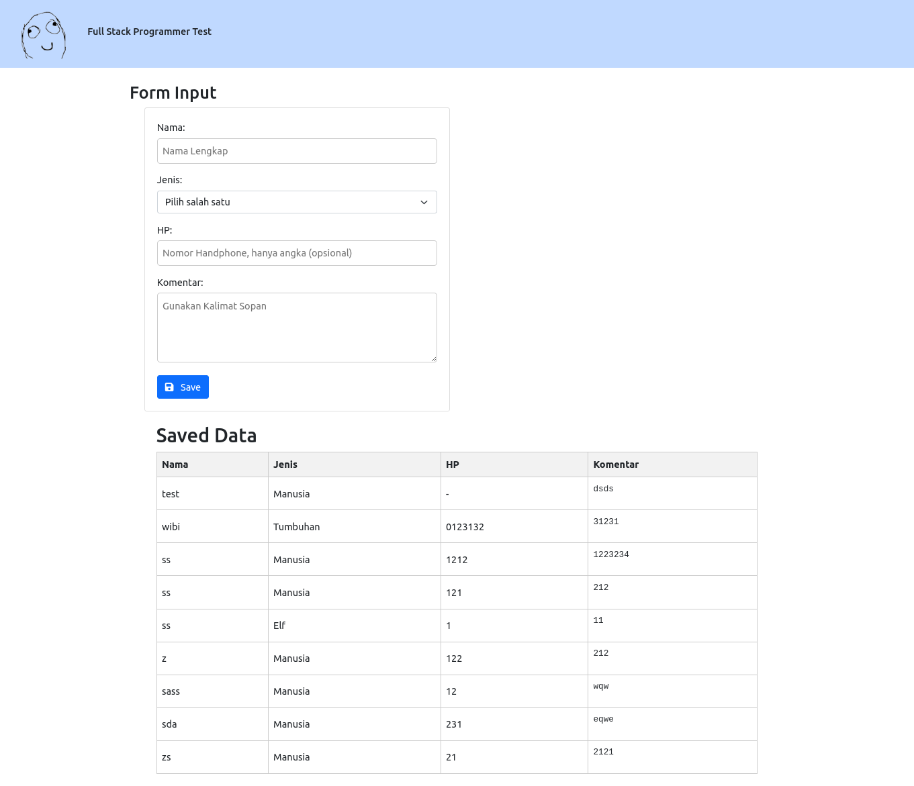
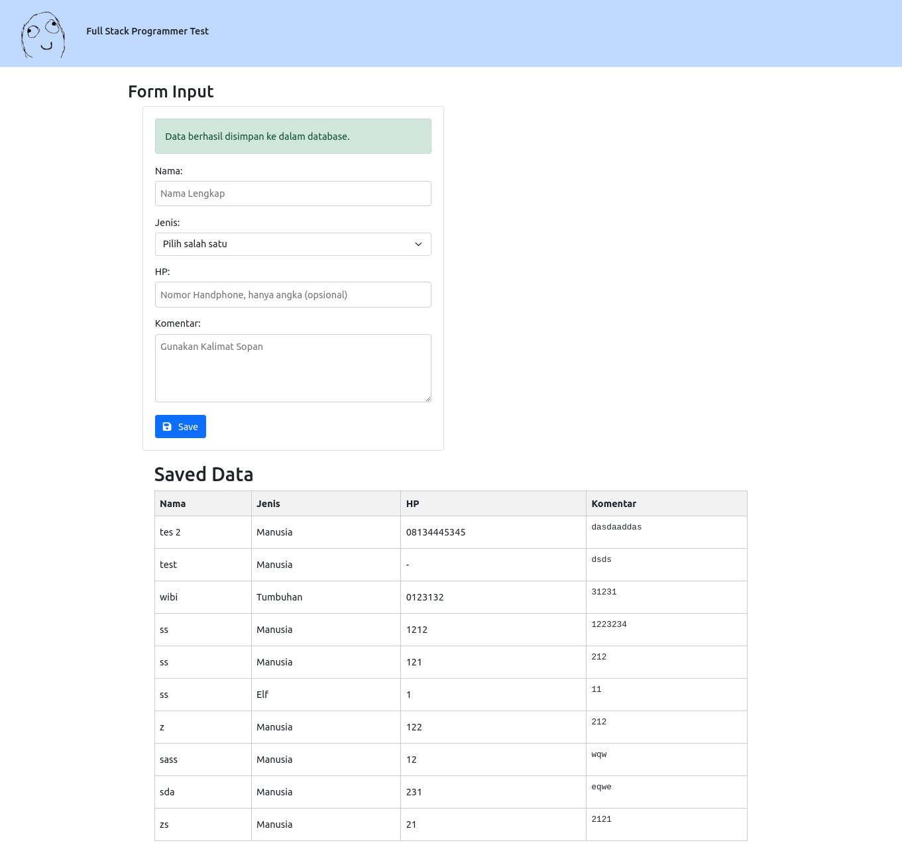
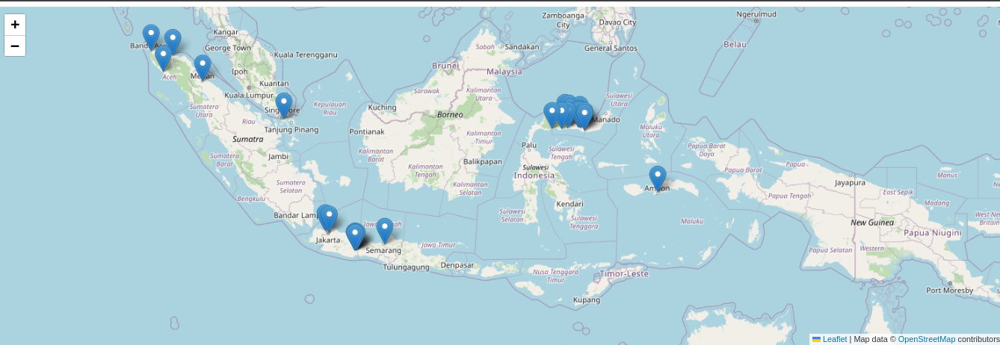
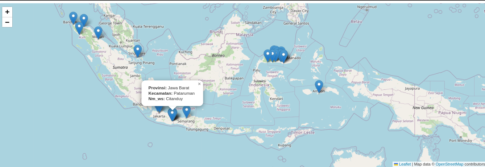

# Aplikasi Web Full Stack

## Pengantar
Aplikasi web ini menggunakan PHP dan MySQL untuk menunjukkan kemampuan full stack. Aplikasi ini termasuk formulir input dan menampilkan data yang disimpan dalam basis data MySQL.

## Prasyarat
- PHP versi 8.2 atau lebih tinggi
- MySQL versi 8 atau lebih tinggi
- koneksi ke internet
## Instalasi

### 1. exctract filezip Fullstack_M Yusuf Yahya

### 2. sesuaikan database
  #### a. buat database pada mysql sesuai yang nama anda inginkan
  #### b. jalankan perintah untuk membuat table
  ```mysql
  CREATE TABLE tabel_data (
    id INT(6) UNSIGNED AUTO_INCREMENT PRIMARY KEY,
    nama VARCHAR(50) NOT NULL,
    jenis VARCHAR(50) NOT NULL,
    hp VARCHAR(14),
    komentar TEXT,
    created_at TIMESTAMP DEFAULT CURRENT_TIMESTAMP
);
  ```
  #### b. sesuiakan file config.php dengan database yang anda gunakan 
  ```php
    <?php
    define('DB_HOST', 'localhost');
    define('DB_USERNAME', 'change_to_database_username');
    define('DB_PASSWORD', 'change_to_database_password');
    define('DB_NAME', 'change_to_database_name');


  ```

### 3. buka folder dalam vs code atau terminal

### 4. ketik perintah 
  ```php  
  php -S localhost:8000
```
### 5. access url dibawah
[http://localhost:8000/](http://localhost:8000/)

### 6. untuk mengakses ujian soal no3
[http://localhost:8000/peta.html](http://localhost:8000/peta.html)

## gambar gambar soal no 1 dan 2




## gambar gambar soal no 3




